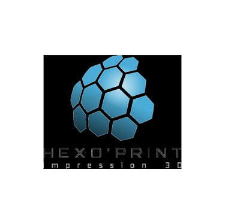

# Hexo'print - Site Web Officiel

<div align="center">
  
  
  <p><strong>Donnez vie à vos projets grâce à l'impression 3D artisanale et sur-mesure</strong></p>
  
  
  
  
  
  
</div>

---

## 📋 Table des matières

- [Hexo'print - Site Web Officiel](#hexoprint---site-web-officiel)
  - [📋 Table des matières](#-table-des-matières)
  - [🎯 À propos](#-à-propos)
    - [🎯 Objectifs du site](#-objectifs-du-site)
  - [✨ Fonctionnalités](#-fonctionnalités)
    - [🏢 Pour les professionnels](#-pour-les-professionnels)
    - [👤 Pour les particuliers](#-pour-les-particuliers)
    - [💻 Fonctionnalités techniques](#-fonctionnalités-techniques)
  - [🛠️ Technologies](#️-technologies)
  - [🚀 Installation](#-installation)
    - [Prérequis](#prérequis)
    - [Steps](#steps)
  - [⚙️ Configuration](#️-configuration)
    - [Variables d'environnement](#variables-denvironnement)
    - [Configuration Sanity](#configuration-sanity)
  - [🎨 Charte graphique](#-charte-graphique)
    - [Utilisation des couleurs](#utilisation-des-couleurs)
  - [📁 Structure du projet](#-structure-du-projet)
  - [🌐 Déploiement](#-déploiement)
    - [Production sur Vercel](#production-sur-vercel)
    - [Commandes utiles](#commandes-utiles)
  - [🤝 Contribution](#-contribution)
    - [Conventions de nommage](#conventions-de-nommage)
    - [Structure des composants](#structure-des-composants)
  - [👨‍💻 Développeur](#-développeur)
  - [📧 Contact](#-contact)
    - [Hexo'print - Impression 3D artisanale](#hexoprint---impression-3d-artisanale)
    - [Développement technique](#développement-technique)

## 🎯 À propos

**Hexo'print** est le site vitrine officiel de l'entreprise d'impression 3D artisanale dirigée par **Yann RAVARY**, auto-entrepreneur basé à **Seysses (31)** en Haute-Garonne.

Le site présente nos services d'impression 3D pour **professionnels** et **particuliers**, avec une expertise technique pointue et un accompagnement personnalisé pour chaque projet.

### 🎯 Objectifs du site

-   **Présentation des services** d'impression 3D sur-mesure
-   **Galerie de réalisations** administrable via Sanity CMS
-   **Blog technique** avec articles sur l'impression 3D
-   **Système de devis** avec upload de fichiers STL/OBJ
-   **Optimisation SEO locale** (Haute-Garonne, France)
-   **Préparation d'un estimateur automatisé** (fonctionnalité future)

## ✨ Fonctionnalités

### 🏢 Pour les professionnels

-   **Prototypage rapide** et fonctionnel
-   **Réparation de pièces** industrielles
-   **Production en petite série**
-   **Conseil technique** personnalisé

### 👤 Pour les particuliers

-   **Modélisme** et pièces détaillées
-   **Objets décoratifs** personnalisés
-   **Projets créatifs** sur-mesure
-   **Accompagnement** selon votre niveau

### 💻 Fonctionnalités techniques

-   ⚡ **Performance optimale** avec Next.js 15 et React 19
-   🎨 **Design system** avec ShadcnUI + Tailwind CSS v4
-   📝 **CMS headless** Sanity intégré avec studio `/studio`
-   🌓 **Mode sombre/clair** automatique
-   📱 **Responsive design** mobile-first
-   🔍 **SEO optimisé** pour le référencement local
-   📤 **Upload de fichiers** STL/OBJ dans le formulaire de devis

## 🛠️ Technologies

| Catégorie           | Technologies                           |
| ------------------- | -------------------------------------- |
| **Framework**       | Next.js 15.3.3 (App Router)            |
| **Language**        | TypeScript 5                           |
| **Styling**         | Tailwind CSS v4, ShadcnUI              |
| **CMS**             | Sanity v3 (headless)                   |
| **Base de données** | Sanity (datasets: `dev`, `production`) |
| **Déploiement**     | Vercel                                 |
| **Animations**      | Framer Motion                          |

## 🚀 Installation

### Prérequis

-   **Node.js** 18+
-   **pnpm** (recommandé)
-   **Git**

### Steps

```bash
# 1. Cloner le repository
git clone https://github.com/votre-username/hexoprint-nextjs15-with-sanity.git
cd hexoprint-nextjs15-with-sanity

# 2. Installer les dépendances
pnpm install

# 3. Configurer les variables d'environnement
cp .env.example .env.local
# Remplir les variables (voir section Configuration)

# 4. Lancer le serveur de développement
pnpm dev
```

🌐 **Accès :**

-   Site : [http://localhost:3000](http://localhost:3000)
-   Studio Sanity : [http://localhost:3000/studio](http://localhost:3000/studio)

## ⚙️ Configuration

### Variables d'environnement

Créez un fichier `.env.local` à la racine :

```bash
# Configuration Sanity
NEXT_PUBLIC_SANITY_PROJECT_ID=your-project-id
NEXT_PUBLIC_SANITY_DATASET=dev
NEXT_PUBLIC_SANITY_API_VERSION=2025-06-03

# Tokens Sanity (optionnels, pour de meilleures performances)
SANITY_API_READ_TOKEN=your-read-token
SANITY_API_WRITE_TOKEN=your-write-token

# Environnement
NODE_ENV=development
```

### Configuration Sanity

1. **Créer un projet Sanity** sur [sanity.io](https://sanity.io)
2. **Récupérer le Project ID** dans votre dashboard
3. **Configurer les datasets** : `dev` et `production`
4. **Générer des tokens** (optionnel) pour l'API

## 🎨 Charte graphique

Le design system est basé sur l'identité visuelle d'Hexo'print :

| Couleur        | HEX       | Usage                      | Classe Tailwind      |
| -------------- | --------- | -------------------------- | -------------------- |
| **Blanc**      | `#FAFAFA` | Arrière-plans              | `bg-hexo-white`      |
| **Gris**       | `#E9E9E9` | Éléments secondaires       | `bg-hexo-gray`       |
| **Bleu clair** | `#96CFE7` | Accents, CTAs secondaires  | `bg-hexo-blue-light` |
| **Bleu foncé** | `#24556A` | CTAs primaires, navigation | `bg-hexo-blue-dark`  |
| **Noir**       | `#293039` | Textes, contrastes         | `bg-hexo-black`      |

### Utilisation des couleurs

```tsx
// Couleurs directes de la charte
<Button className="bg-hexo-blue-dark text-hexo-white">
  Demander un devis
</Button>

// Variables du design system ShadcnUI
<Card className="bg-card border-border">
  <Button variant="default">Action principale</Button>
</Card>
```

## 📁 Structure du projet

```
hexoprint-nextjs15-with-sanity/
├── src/
│   ├── app/                    # App Router Next.js 15
│   │   ├── studio/            # Sanity Studio intégré (/studio)
│   │   ├── page.tsx           # Page d'accueil
│   │   ├── layout.tsx         # Layout principal
│   │   └── globals.css        # Styles globaux + variables CSS
│   ├── components/            # Composants React
│   │   ├── ui/               # Composants ShadcnUI
│   │   └── hexo-theme-showcase.tsx # Démo de la charte
│   ├── lib/                   # Utilitaires
│   ├── sanity/               # Configuration Sanity
│   │   ├── lib/              # Client, helpers
│   │   └── schemaTypes/      # Schémas CMS
│   └── types/                # Types TypeScript
├── public/                    # Assets statiques
│   ├── logos/                # Logos Hexo'print
│   └── galerie/              # Images galerie
├── tailwind.config.ts         # Config Tailwind v4
├── sanity.config.ts          # Config Sanity Studio
└── components.json           # Config ShadcnUI
```

## 🌐 Déploiement

### Production sur Vercel

1. **Push sur GitHub** de votre branche main
2. **Connecter à Vercel** via GitHub
3. **Configurer les variables d'environnement** dans Vercel :
    ```bash
    NEXT_PUBLIC_SANITY_PROJECT_ID=your-project-id
    NEXT_PUBLIC_SANITY_DATASET=production
    NEXT_PUBLIC_SANITY_API_VERSION=2025-06-03
    SANITY_API_READ_TOKEN=your-production-read-token
    SANITY_API_WRITE_TOKEN=your-production-write-token
    ```
4. **Déployer automatiquement** 🚀

### Commandes utiles

```bash
# Build en local
pnpm build

# Linter
pnpm lint

# Ajouter des composants ShadcnUI
pnpm dlx shadcn@latest add button card input

# Sanity CLI
pnpm sanity deploy  # Déployer le studio
pnpm sanity manage  # Gérer les datasets
```

## 🤝 Contribution

Ce projet respecte les conventions de code strictes :

### Conventions de nommage

-   **Fichiers** : `kebab-case.tsx`
-   **Composants** : `PascalCase`
-   **Fonctions** : `camelCase`
-   **Variables** : `camelCase`
-   **Types** : `PascalCaseType`

### Structure des composants

```tsx
// ✅ Correct
export function MonComposant(props: { title: string; count: number }) {
    return <div>{props.title}</div>;
}

// ✅ Avec plus de 2 props
type MonComposantProps = {
    title: string;
    count: number;
    isVisible: boolean;
};

export function MonComposant(props: MonComposantProps) {
    return <div>{props.title}</div>;
}
```

## 👨‍💻 Développeur

Ce projet a été développé par **[Yann THOBENA](https://www.yanndevweb.com/)**, développeur web spécialisé dans les technologies modernes React/Next.js.

🌐 **Portfolio** : [yanndevweb.com](https://www.yanndevweb.com/)  
📍 **Localisation** : Toulouse, France  
💼 **Spécialités** : Next.js, TypeScript, React, Design Systems

---

## 📧 Contact

### Hexo'print - Impression 3D artisanale

📍 Seysses (31), Haute-Garonne, France  
👨‍💼 Yann RAVARY - Auto-entrepreneur

### Développement technique

👨‍💻 **Yann THOBENA** - Développeur web  
🌐 [yanndevweb.com](https://www.yanndevweb.com/)  
📍 Toulouse, France

---

<div align="center">
  <p>Développé avec ❤️ par <a href="https://www.yanndevweb.com/">Yann THOBENA</a> pour l'impression 3D artisanale</p>
  <p><strong>Next.js 15</strong> • <strong>TypeScript</strong> • <strong>Tailwind CSS v4</strong> • <strong>Sanity</strong></p>
</div>
